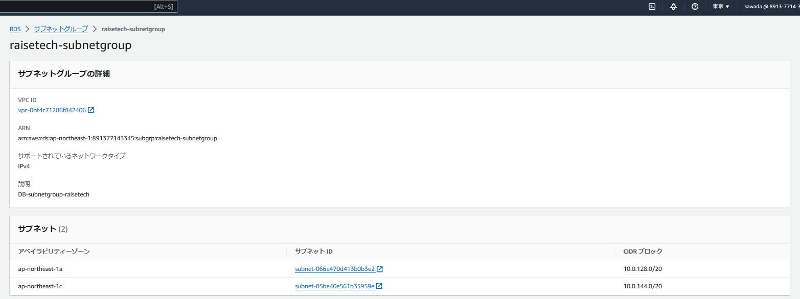
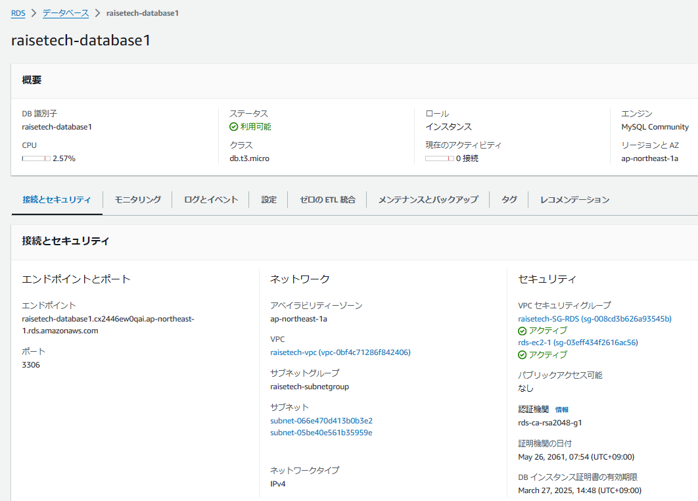
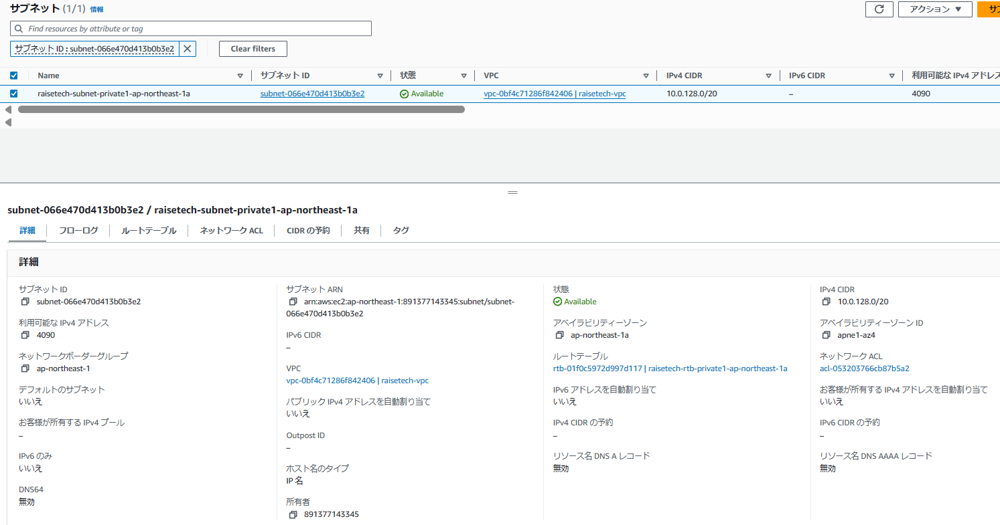
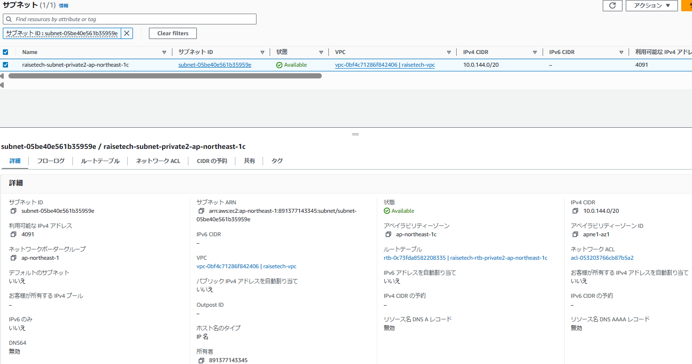

# 第四回授業課題

## VPC、サブネット構築
 - ウィザード経由でVPC内にサブネット（パブリック×2、プライベート×2）とIGWを作成
 

## EC2インスタンスの作成
 - ウィザード経由で作成
 - セキュリティーグループとキーペア作成
 
 
 

## RDSの作成
 - プライベートサブネットにMySQLのDBを作成しセキュリティグループも作成
 
 
 
 
 - RDSに設定したプライベートサブネットの詳細を追加
 
 
 

## EC2からRDSへの接続確認
 

